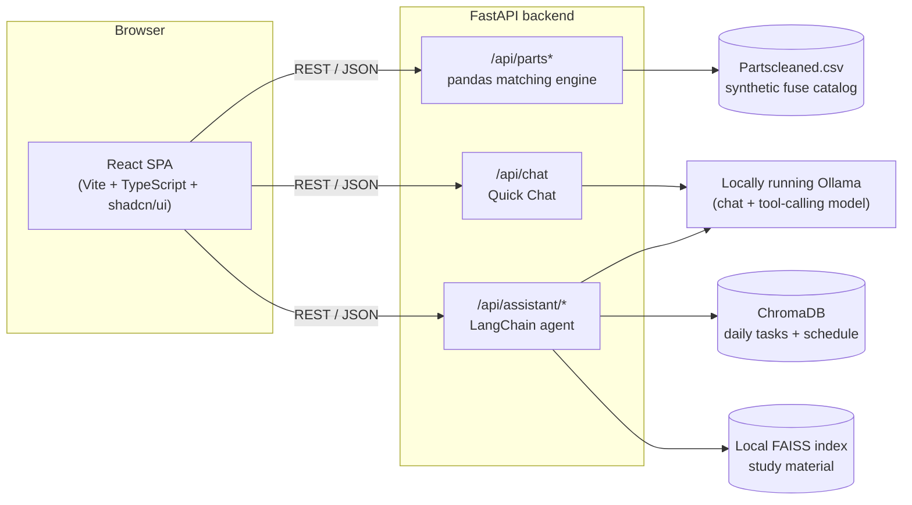
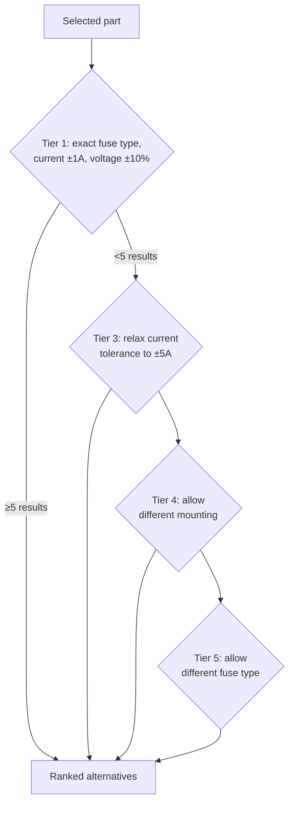
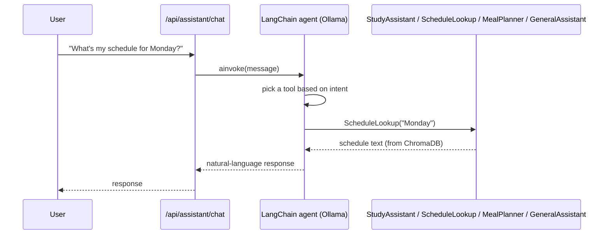
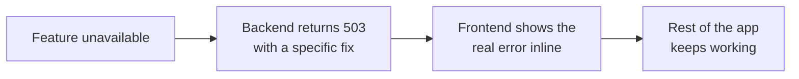

# Development Blueprint

This document is the "how and why" behind this project — architecture diagrams, the engineering decisions made along the way, and the reasoning behind the non-obvious choices. The [README](../README.md) covers what the app does and how to run it; this covers how it's built.

## System architecture



Three independent capabilities behind one API, not a monolith: `/api/parts*` never touches Ollama, so Part Sourcing works even if no local model is running. `/api/chat` and `/api/assistant/*` each fail independently and return a clean `503` with a specific fix (which model to pull) instead of a raw crash — see [`app/routers/chat.py`](../backend/app/routers/chat.py) and [`app/routers/assistant.py`](../backend/app/routers/assistant.py).

## Part Sourcing: tiered relaxation matching



Each tier is strictly more permissive than the last (verified by a regression test — `backend/tests/test_filtering.py::test_relaxation_tiers_find_at_least_as_many_as_the_previous_tier`). Explanations are rule-based by default (fast, deterministic, free) with an optional AI-generated mode (Phi-1.5) for more natural phrasing — both are exposed through the same `POST /api/parts/{id}/explain` endpoint, keeping the choice a runtime toggle rather than two separate code paths.

## Workday Help: tool-routing agent



A tool-calling agent (`langchain.agents.create_agent`) replaces what used to be a keyword `if/elif` chain — routing survives paraphrasing ("what am I doing Monday" vs. "show me my schedule") instead of breaking on any wording it didn't anticipate. Tool-calling requires a model that actually supports it; see [`assistant_agent.py`](../backend/app/services/assistant_agent.py) for the model requirement and the default.

## Data model

| Store | What's in it | Notes |
|---|---|---|
| `data/Partscleaned.csv` | Synthetic fuse catalog (ID, description, application, electrical ratings, mounting) | No public dataset matched this schema, so one was generated with plausible real-world rating values — see `scripts/generate_synthetic_dataset.py`. |
| ChromaDB `daily_tasks` | Free-form task/answer/date entries | User-logged daily check-ins. |
| ChromaDB `daily_schedule` | One document per weekday | Seeded idempotently on backend startup ([`schedule_seed.py`](../backend/app/services/schedule_seed.py)) so the Schedule tool has real data with no manual setup step. |
| Local FAISS index | Chunked PDF study material | Built automatically from `data/pdfs/` (or `Report.pdf` as a fallback) the first time it's needed, persisted to disk. |

## Graceful degradation, by design

Every optional dependency (Ollama, Phi-1.5 weights) fails independently and explains itself:



No feature's outage cascades into another's, and no error is swallowed into a generic "something went wrong" — the 503 body names exactly what's missing and the command to fix it (e.g. `ollama pull mistral`).

## Demo video

[`docs/demo.gif`](demo.gif) (also [`docs/demo.mp4`](demo.mp4) for higher quality) is embedded at the top of the README. To be transparent about what it actually is: **it's a code-authored recreation of the app's screens, built with [Remotion](https://remotion.dev)** (React components rendered frame-by-frame to video) — not a screen capture of a real session. It's a quick visual pitch, not footage of the live interactive app.

For a real screen recording of the live app (recommended in addition to the promo video, not instead of it):

```sh
# Terminal 1
cd backend && uv run uvicorn app.main:app --reload --port 8000

# Terminal 2
cd frontend && npm run dev
```

Open `http://localhost:5173`, record a walkthrough (Windows: Win+G for the Xbox Game Bar recorder; macOS: Cmd+Shift+5), then drop the resulting `.gif` or `.mp4` into `docs/` alongside the promo video.
